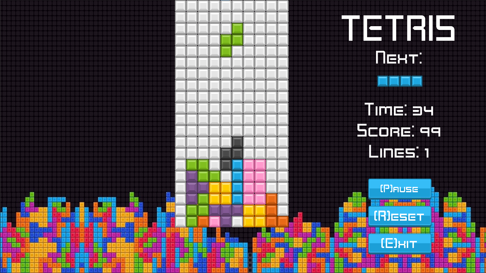

# [Tetris](https://sp4r0w.itch.io/tetris)
##A clone of the classic Tetris game made in Godot

### Description
-------------
This is a remake of a Tetris clone made a few years ago in Solar2D. 
Our aims were to make it look more appealing visually and make it less buggy.  
Various issues of the Lua's version were fixed and some new visual features were added (i.e ghost block) 

### Getting Started
-------------
To compile this project, you will need at least Godot v4.3. Do not forget you will need the required export templates.   
More in-depth guide is avaiable here: https://docs.godotengine.org/en/stable/tutorials/export/exporting_projects.html  
You're free to modify the project as you wish.

### Installation
- This game is playable on the [Itch](https://sp4r0w.itch.io/tetris) page.
- Download the project from [Itch](https://sp4r0w.itch.io/tetris) and follow the instructions on how to play the game.
- You can also [clone](https://docs.github.com/en/repositories/creating-and-managing-repositories/cloning-a-repository) or download the repository and play it through Godot Editor.

### Screenshots
-------------

